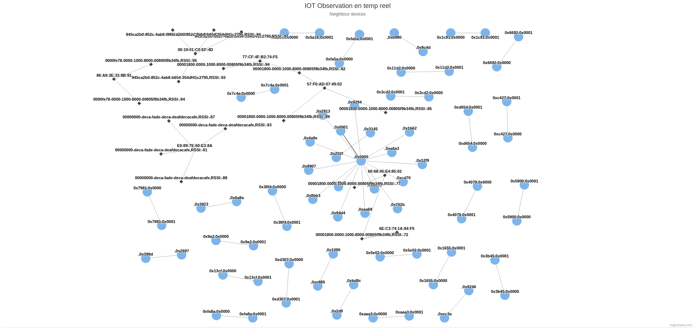

# WbanGr

[docs](/docs)

## DOCKER API

[install](https://docs.docker.com/engine/install/)

[post_install](https://docs.docker.com/engine/install/linux-postinstall)

## HOW TO RUN
Use docker X11 fowarding 

```bash
make xserver
```

Just run shell
```bash
make shell
```

## Web Interface

## Real time IOT observation

### link : http://127.0.0.1:5000




## Hardware

<a href="https://www.amazon.fr/NooElec-HackRF-Software-Adapter-Bundle/dp/B071FMH7T5?__mk_fr_FR=%C3%85M%C3%85%C5%BD%C3%95%C3%91&crid=3Q5JW77YRKL59&keywords=hackrf&qid=1672026578&sprefix=hackr%2Caps%2C80&sr=8-2-spons&sp_csd=d2lkZ2V0TmFtZT1zcF9hdGY&psc=1&linkCode=li3&tag=rftoolkit06-21&linkId=471d50721afe2c2f8c0a2651f1ba609c&language=fr_FR&ref_=as_li_ss_il" target="_blank"></a>
