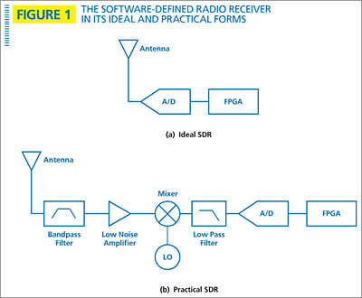

 # Software defined radio 802.15.6
 

## Links

Base Gnuradio: 

[European_sdr_base](https://www.youtube.com/watch?v=NAIzz4oLWz8)

SDR design:

[802.15.6](https://www.semanticscholar.org/paper/A-Reconfigurable-Sliding-IF-Transceiver-for-400-GHz-Zhang-Jiang/4e178eb641cf5b3081317fece56054cbc7f7b1c4)

DEMODULATION:

[DQPSK_PARAMETERS](https://www.researchgate.net/publication/273257601_An_IEEE_802156_Standard_Compliant_25nJbit_Multiband_WBAN_Transmitter_using_Phase_Multiplexing_and_Injection_Locking)

RESEARCH:

[main_research](https://www.nature.com/articles/s41598-018-38303-x)

[french_but_manyinformation](https://tel.archives-ouvertes.fr/tel-01124373/document)

[complete_research](https://jnrdm2019.sciencesconf.org/data/pages/proceedings.pdf)

Bind to tshark: 

[rftap](https://github.com/rftap/gr-rftap)