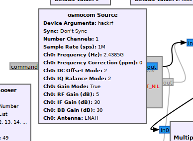
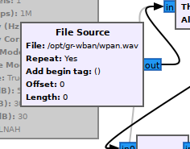

# SOURCE

We use the reference band of the wban protocol as a source

As you can notice there are 2 modes of use online and offline

# ONLINE RECEIVER

this reverver is based on the network interface of your rf module

# OFFLINE RECEIVER

this reverver is based on an audio file in wav format simulating the rf module.

Nevertheless the recording must be done with precaution to eliminate the most noise

